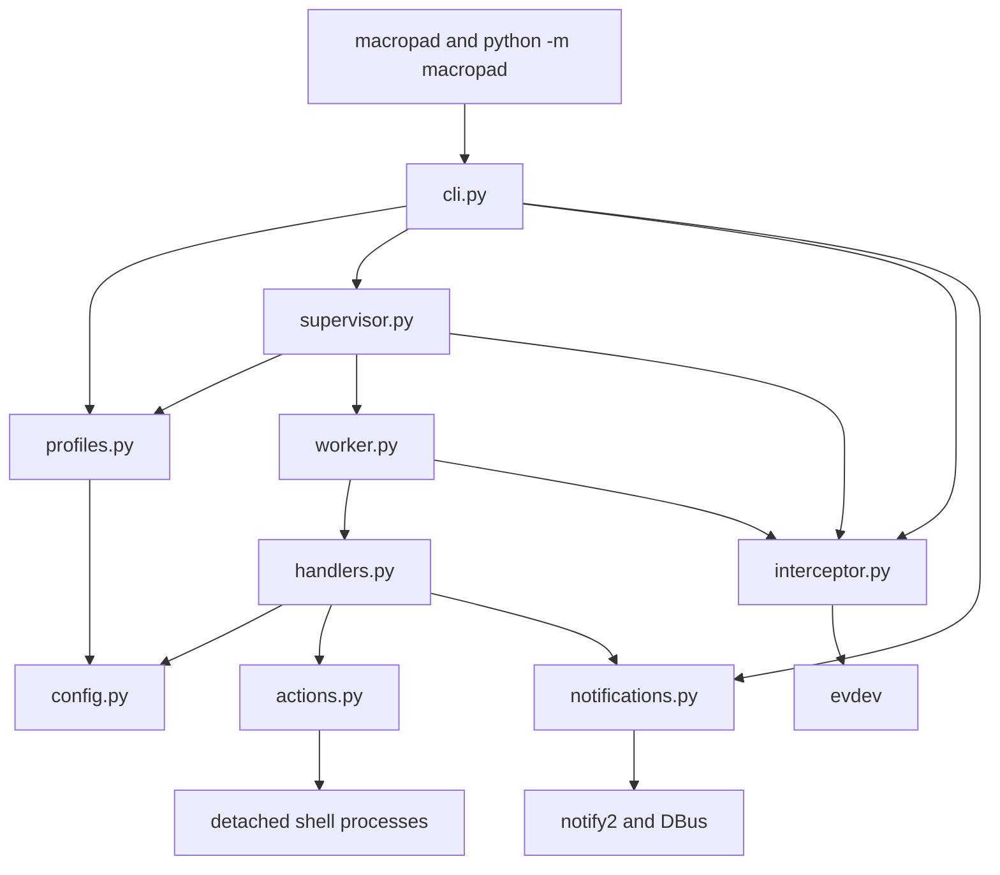
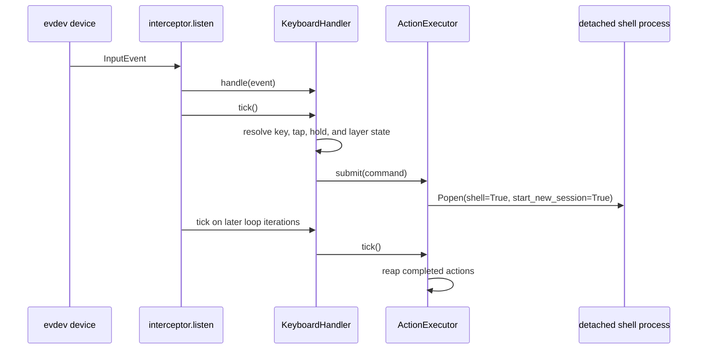

# Macropad Runtime Architecture

This directory contains the complete runtime implementation for Macropad. The package intentionally
uses a flat module layout: the codebase is small enough that domain-style subpackages would add
navigation and dependency overhead without creating useful boundaries.

This document is the architecture reference for contributors. Update it whenever module ownership,
dependency direction, process lifecycle, or the profile and event flows change.

## Module Map

| Module | Responsibility |
| --- | --- |
| `__main__.py` | Implements the `python -m macropad` entry point by delegating to `cli.main()`. |
| `cli.py` | Parses arguments, dispatches commands, discovers profile files, owns profile watching, and coordinates top-level shutdown. |
| `config.py` | Defines the deeply immutable, picklable profile configuration model and validation error type. |
| `profiles.py` | Loads strict YAML, validates and normalizes profile data, merges fragments, serializes configurations, and creates sample configurations. |
| `supervisor.py` | Reconciles desired profiles with worker slots, owns child processes, applies restart backoff, and enforces bounded shutdown. |
| `worker.py` | Defines the child-process entry point, installs the worker signal handler, constructs the keyboard handler, and owns handler shutdown. |
| `interceptor.py` | Discovers evdev devices, detects newly connected keyboards, grabs matching event nodes, and forwards input events to a handler. |
| `handlers.py` | Resolves key events, tap and hold sequences, layers, and internal handler commands into action submissions. |
| `actions.py` | Starts trusted shell actions as detached processes and enforces the per-worker concurrency limit. |
| `notifications.py` | Initializes optional desktop notifications and sends notifications without making them a runtime requirement. |
| `logging_config.py` | Configures structured console logging and renders known context fields consistently. |
| `assets/` | Contains package resources, currently the desktop notification icon. |

## Dependency Diagram

Dependencies should continue to point inward toward immutable configuration and outward toward
system adapters. In particular:

- `profiles.py` must remain independent of worker, handler, process, and device state.
- `supervisor.py` owns processes but does not process keyboard events.
- `worker.py` is the boundary where immutable configuration becomes mutable runtime state.
- `interceptor.py` owns evdev resources but does not construct or shut down handlers.
- `handlers.py` may submit actions and notifications but must not manage worker processes.
- `actions.py`, `notifications.py`, and `interceptor.py` are adapters to operating-system services.

## Process Model

The CLI runs in the parent process. `ProfileSupervisor` maintains one worker slot for each configured
keyboard name. Each slot has its own `multiprocessing.Process`, shutdown event, restart counters, and
retry deadline.

Only immutable `ProfileConfig` data crosses the process boundary. The parent does not construct a
`KeyboardHandler` or `ActionExecutor`. The child enters through `worker.run()`, installs its SIGTERM
handler, constructs its handler, and then enters the interception loop. This keeps mutable resources
owned by the process that uses them and avoids requiring runtime objects to be serialized.

The project is Linux-only. Device identity is the evdev keyboard name, and one worker attaches to all
current `/dev/input/event*` nodes with that name.

## Startup Flow

1. `cli.main()` configures logging, parses arguments, and dispatches to `run_listen()` or
   `run_detect()`.
2. `run_listen()` initializes optional notifications and installs the parent SIGTERM handler.
3. The CLI resolves explicit profile paths and all `.yml` files in requested profile directories.
4. `ProfileSupervisor.start()` calls `prepare_profiles()` before starting any process.
5. Every YAML file is loaded and validated before fragments are merged by keyboard name.
6. The supervisor creates one worker slot per merged `ProfileConfig` and starts `worker.run()` in a
   child process.
7. The worker constructs `KeyboardHandler` and calls `interceptor.listen()`.
8. The interceptor waits for matching devices, opens and grabs every matching event node, and begins
   forwarding input events.

If the default configuration directory is used, the CLI creates it when necessary, installs a sample
profile if no YAML files exist, and automatically enables profile watching.

## Input And Action Flow

Simple `up` or `down` bindings can execute immediately. Bindings involving hold, double-tap, or
triple-tap resolution use monotonic deadlines and are advanced by `KeyboardHandler.tick()` on the
listener thread. Layer timeouts use the same threadless mechanism.

Actions are trusted shell strings. Each worker may have at most eight active actions; additional
actions are dropped rather than queued. Action processes are detached and are not terminated when a
worker reloads or stops.

## Device Lifecycle

`matching_device_paths()` enumerates evdev paths, opens each path long enough to inspect its name, and
closes every probe. Paths that disappear during enumeration are ignored.

The listener opens and exclusively grabs all paths matching the configured keyboard name. When a
path reports `ENODEV`, it is closed and removed. The listener rescans only after every matching path
has gone; it intentionally does not acquire an additional path while another matching path remains
connected.

`detect()` snapshots existing paths, waits for a new path even when another device disappears at the
same time, and returns the new keyboard's name after observing a pressed key. Probe handles are
always closed before it returns.

## Profile Reload Flow

The Watchdog polling observer runs in a background thread, but it never reloads configuration itself.
It places changed YAML paths into a queue owned by the CLI. The parent supervision loop drains that
queue and invokes `ProfileSupervisor.reload()`.

Reload follows a validate-then-reconcile model:

1. Load and validate the complete candidate file set.
2. Merge all fragments by keyboard name.
3. Leave workers with equal immutable configuration running, updating only their source paths.
4. Stop workers for removed or changed configurations.
5. Start workers for added or changed configurations.
6. Preserve independent failure and restart state for unchanged workers.

An invalid candidate fails before reconciliation, so currently running workers remain intact.

## Failure And Shutdown Behavior

The supervisor checks workers once per parent loop iteration. A failed worker receives exponential
restart backoff from one second up to thirty seconds. After thirty stable seconds, its failure count
is reset. One failed keyboard does not restart healthy workers.

Parent shutdown sets every worker shutdown event and waits up to five seconds across the worker set.
Workers cooperatively leave the listener loop, close all evdev handles, and shut down their handler.
Processes that do not stop are killed and joined for one additional second. A process that survives
the kill is reported as a shutdown failure.

Desktop notification initialization and delivery are both optional. Failures are logged and never
prevent headless startup or event handling.

## Configuration Ownership

`config.py` contains only immutable value objects:

- `ProfileConfig` owns the device name, profile version, keyboard configuration, and diagnostic
  source.
- `KeyboardConfig` owns base bindings and named layers.
- `LayerConfig` owns layer bindings.
- `BindingConfig` maps event names to command tuples.
- `FrozenDict` prevents nested mutation while keeping configurations comparable, hashable, and
  picklable.

`profiles.py` is the only module that converts untrusted YAML-shaped data into these objects. Keep
source names and field paths in every validation error because reload diagnostics depend on them.

## Extension Guidelines

- Add profile schema behavior in `profiles.py` and immutable values in `config.py`.
- Add keyboard event semantics in `handlers.py` and use fake monotonic clocks in tests.
- Add evdev discovery or handle behavior in `interceptor.py` without moving process policy there.
- Add worker process setup or cleanup in `worker.py`.
- Add reconciliation, restart, or bounded-shutdown policy in `supervisor.py`.
- Add command-line orchestration in `cli.py`; create a command package only if command count or
  complexity materially grows.
- Keep operating-system adapters optional or failure-tolerant where the service can continue without
  them.

Unit tests mirror the runtime modules under `tests/test_*.py`. Packaging and lifecycle smoke tests
live under `tests/integration/` and are intentionally excluded from normal unit-test discovery.
