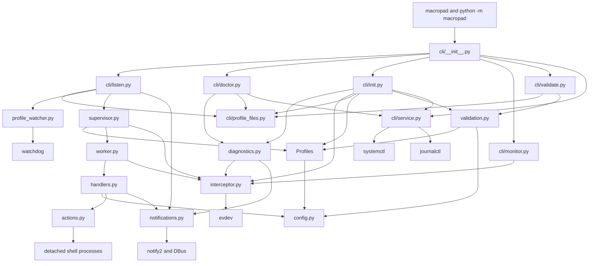
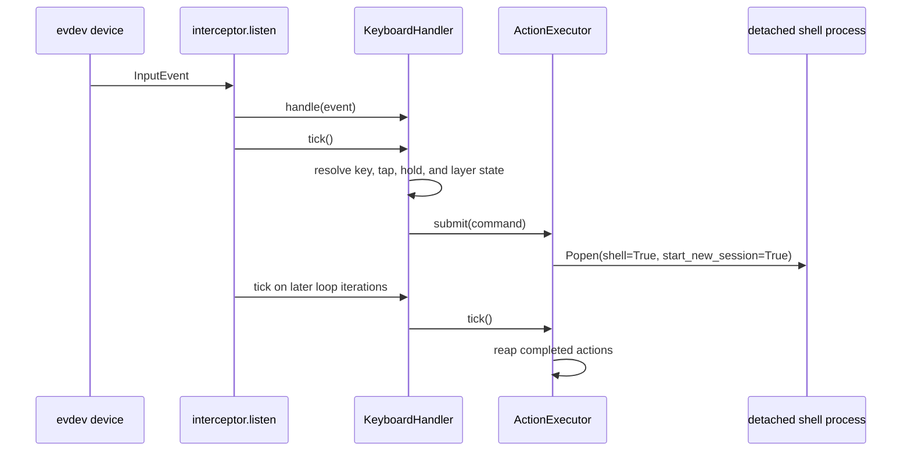
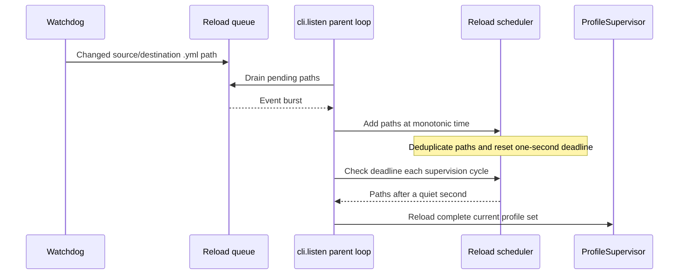

# Macropad Runtime Architecture

This directory contains the complete runtime implementation for Macropad. Runtime domains use a
flat module layout, while the `cli/` package groups command-specific orchestration behind a small
argument-parsing and dispatch boundary.

This document is the architecture reference for contributors. Update it whenever module ownership,
dependency direction, process lifecycle, or the profile and event flows change.

## Module Map

| Module                 | Responsibility                                                                                                                         |
|------------------------|----------------------------------------------------------------------------------------------------------------------------------------|
| `__main__.py`          | Implements the `python -m macropad` entry point by delegating to `cli.main()`.                                                         |
| `cli/__init__.py`      | Parses arguments, dispatches commands, and handles process-wide command errors.                                                        |
| `cli/listen.py`        | Coordinates listener startup, profile reloads, the parent supervision loop, and top-level shutdown.                                    |
| `cli/doctor.py`        | Renders read-only environment diagnostics and returns status based on blocking results.                                                |
| `cli/init.py`          | Orchestrates guided input checks, device/key capture, collision-safe fragment creation, and generated-profile validation.              |
| `cli/monitor.py`       | Lists readable devices and renders non-grabbing key-event streams.                                                                     |
| `cli/validate.py`      | Resolves validation inputs and delegates the standalone validation workflow.                                                           |
| `cli/profile_files.py` | Owns the default configuration path and discovers unique profile files for CLI commands.                                               |
| `cli/service.py`       | Runs service command actions through explicit `systemctl --user` and `journalctl --user` invocations.                                  |
| `profile_watcher.py`   | Adapts Watchdog events, manages the polling observer, and schedules trailing-edge profile reloads.                                     |
| `diagnostics.py`       | Classifies input access, profiles, notifications, installation paths, and environment checks.                                          |
| `validation.py`        | Loads complete validation candidates, collects file and merged errors, and renders validation reports.                                 |
| `config.py`            | Defines the deeply immutable, picklable profile configuration model and validation error type.                                         |
| `profiles.py`          | Loads strict YAML and validates, normalizes, groups, and merges profile configurations.                                                |
| `supervisor.py`        | Reconciles desired profiles with worker slots, owns child processes, applies restart backoff, and enforces bounded shutdown.           |
| `worker.py`            | Defines the child-process entry point, installs the worker signal handler, constructs the keyboard handler, and owns handler shutdown. |
| `interceptor.py`       | Discovers evdev devices, detects newly connected keyboards, grabs matching event nodes, and forwards input events to a handler.        |
| `handlers.py`          | Resolves key events, tap and hold sequences, layers, and internal handler commands into action submissions.                            |
| `actions.py`           | Starts trusted shell actions as detached processes and enforces the per-worker concurrency limit.                                      |
| `notifications.py`     | Initializes optional desktop notifications and sends notifications without making them a runtime requirement.                          |
| `logging_config.py`    | Configures structured console logging and renders known context fields consistently.                                                   |
| `assets/`              | Contains package resources, currently the desktop notification icon.                                                                   |

## Dependency Diagram

Dependencies should continue to point inward toward immutable configuration and outward toward
system adapters. In particular:

- `profiles.py` must remain independent of worker, handler, process, and device state.
- `profile_watcher.py` owns filesystem event filtering and reload timing but never reloads profiles.
- `diagnostics.py` classifies checks but leaves evdev and systemd resource ownership in their
  existing adapters.
- `cli/service.py` owns systemd and journal subprocess invocation but no daemon runtime state.
- `supervisor.py` owns processes but does not process keyboard events.
- `worker.py` is the boundary where immutable configuration becomes mutable runtime state.
- `interceptor.py` owns evdev resources but does not construct or shut down handlers.
- `handlers.py` may submit actions and notifications but must not manage worker processes.
- `actions.py`, `notifications.py`, and `interceptor.py` are adapters to operating-system services.

## Process Model

The CLI runs in the parent process. `ProfileSupervisor` maintains one worker slot for each configured
keyboard name. Each slot has its own `multiprocessing.Process`, shutdown event, restart counters, and
retry deadline.

Only immutable `ProfileConfig` data crosses the process boundary. The parent does not construct a
`KeyboardHandler` or `ActionExecutor`. The child enters through `worker.run()`, installs its SIGTERM
handler, constructs its handler, and then enters the interception loop. This keeps mutable resources
owned by the process that uses them and avoids requiring runtime objects to be serialized.

The project is Linux-only. Device identity is the evdev keyboard name, and one worker attaches to all
current `/dev/input/event*` nodes with that name.

## Startup Flow

1. `cli.main()` configures logging, parses arguments, and dispatches to the focused `doctor`, `init`,
   `listen`, `monitor`, `validate`, or `service` command module.
2. `cli.listen.run()` initializes optional notifications and installs the parent SIGTERM handler.
3. `cli.profile_files` resolves explicit profile paths and all `.yml` files in requested profile
   directories.
4. `ProfileSupervisor.start()` calls `prepare_profiles()` before starting any process.
5. Every YAML file is loaded and validated before fragments are merged by keyboard name.
6. The supervisor creates one worker slot per merged `ProfileConfig` and starts `worker.run()` in a
   child process.
7. The worker constructs `KeyboardHandler` and calls `interceptor.listen()`.
8. The interceptor waits for matching devices, opens and grabs every matching event node, and begins
   forwarding input events.

`cli.profile_files` resolves the default directory from an absolute `XDG_CONFIG_HOME`, falling back
to `~/.config` when it is unset or invalid. If a custom XDG profile directory is absent but the
legacy `~/.config/macropad/profiles/` directory exists, the legacy path remains active until the XDG
directory is created. No files are migrated automatically.

If the resolved default configuration directory contains profiles, the CLI automatically enables
profile watching. If it does not exist or contains no YAML files, startup fails with profile-format
guidance without creating directories or example files.

The validation command module delegates to `validation.run()`, which uses the same complete load,
validation, grouping, and merge path as worker startup, but never initializes notifications,
constructs a supervisor, or opens an input device. Semantic checks that depend on the complete device
configuration, including layer references, run after fragments for that device are merged.

## Guided Initialization Flow

`cli.init` is interactive orchestration over existing adapters and profile APIs; it does not own
evdev handles or duplicate profile merge rules.

1. Read systemd service state and render the blocking input checks from `diagnostics.py`.
2. Ask the user to disconnect the target, then call the non-grabbing `interceptor.detect()` under a
   monotonic timeout while the user reconnects it and presses a key.
3. Load and merge current default-directory profiles. For an already-profiled device, list its
   fragment paths and require confirmation before proposing another fragment.
4. If that key's release event is already bound, call `interceptor.capture_key()` to wait for release
   and capture a different key from the same device.
5. Validate the proposed fragment together with all loaded profiles in memory.
6. Select a slug-based filename with a numeric collision suffix, create it exclusively, and run the
   normal complete validation workflow against the on-disk directory.
7. Remove only the generated file on cancellation or any write or validation failure. On success,
   report the exact path, refresh service state, qualify watch behavior when effective arguments are
   unknown, and show the next foreground or service command.

## Input And Action Flow

Simple `up` or `down` bindings can execute immediately. Bindings involving hold, double-tap, or
triple-tap resolution use monotonic deadlines and are advanced by `KeyboardHandler.tick()` on the
listener thread. Layer timeouts use the same threadless mechanism.

Actions are trusted shell strings. Each worker may have at most eight active actions; additional
actions are dropped rather than queued. Action processes are detached and are not terminated when a
worker reloads or stops.

The checked-in systemd user unit gives actions a deterministic `PATH` containing `~/bin`,
`~/.local/bin`, and standard system command directories. It intentionally does not start Macropad
through a login shell.

## Device Lifecycle

`matching_device_paths()` enumerates evdev paths, opens each path long enough to inspect its name, and
closes every probe. Paths that disappear during enumeration are ignored. Permission failures and
other open errors are logged once per unresolved operation and path rather than silently treated as
an absent device or repeatedly flooding the journal.

The listener opens and exclusively grabs all paths matching the configured keyboard name. When a
path reports `ENODEV`, it is closed and removed. The listener rescans only after every matching path
has gone; it intentionally does not acquire an additional path while another matching path remains
connected.

`probe_device_access()` briefly opens, grabs, ungrabs, and closes each current event device for
`macropad doctor`. It records `EACCES`, `EBUSY`, `ENODEV`, and other operation failures as data so the
diagnostic workflow can provide remediation without leaking handles. Runtime grab conflicts and
permission failures are logged distinctly before a worker exits or continues scanning.
An `EBUSY` probe is a nonblocking warning when the Macropad user service is active and a blocking
failure otherwise; stopping the service and rerunning the check disambiguates ownership.

`interceptor.monitor()` opens every current path matching an exact device name without calling
`grab()`. It rescans while other paths remain connected, reports each connection and disconnection,
and reacquires matching paths after reconnect. This monitoring behavior is independent from the
listener's intentional policy of rescanning only after all matching paths are gone.
The command reports when the Macropad service is active because its configured devices are already
exclusively grabbed and cannot deliver events to the non-grabbing monitor until the service stops.

The internal `detect()` helper snapshots existing paths, waits for a new path even when another
device disappears at the same time, and returns the new keyboard's name, event path, and first
pressed `KEY_*` name. One monotonic deadline bounds both reconnect and key capture. `capture_key()`
uses the same non-grabbing handle lifecycle for another key on a known device, but waits for held keys
to be released before accepting another press. Probe handles are always closed before either helper
returns or times out. These helpers are used by guided initialization rather than exposed as
standalone commands.

## Profile Reload Flow

The Watchdog polling observer runs in a background thread, but it never reloads configuration itself.
It inspects both source and destination paths for each event and places every relevant `.yml` path
into a queue owned by `cli.listen`. This catches direct writes, create/delete events, profile renames,
and atomic saves that move a temporary file onto a profile.

The scheduler is owned by the parent loop. Every new batch moves its monotonic deadline forward, so
reload happens only after one quiet second. The resulting changed-path list is deduplicated and
included in reload success and failure logs.

Reload follows a validate-then-reconcile model:

1. Load and validate the complete candidate file set.
2. Merge all fragments by keyboard name.
3. Leave workers with equal immutable configuration running, updating only their source paths.
4. Stop workers for removed or changed configurations.
5. Start workers for added or changed configurations.
6. Preserve independent failure and restart state for unchanged workers.

An invalid candidate fails before reconciliation, so currently running workers remain intact.

## Failure And Shutdown Behavior

The supervisor checks workers once per parent loop iteration. A failed worker receives exponential
restart backoff from one second up to thirty seconds. After thirty stable seconds, its failure count
is reset. One failed keyboard does not restart healthy workers.

Parent shutdown sets every worker shutdown event and waits up to five seconds across the worker set.
Workers cooperatively leave the listener loop, close all evdev handles, and shut down their handler.
Processes that do not stop are killed and joined for one additional second. A process that survives
the kill is reported as a shutdown failure.

Desktop notification initialization and delivery are both optional. Failures are logged and never
prevent headless startup or event handling.

## Configuration Ownership

`config.py` contains only immutable value objects:

- `ProfileConfig` owns the device name, profile version, keyboard configuration, diagnostic source,
  and deferred layer-reference paths used by merged validation.
- `KeyboardConfig` owns base bindings and named layers.
- `LayerConfig` owns layer bindings.
- `BindingConfig` maps event names to command tuples.
- `FrozenDict` prevents nested mutation while keeping configurations comparable, hashable, and
  picklable.

`profiles.py` is the only module that converts untrusted YAML-shaped data into these objects. Keep
source names and field paths in every validation error because reload diagnostics depend on them.

## Extension Guidelines

- Add profile schema behavior in `profiles.py` and immutable values in `config.py`.
- Add keyboard event semantics in `handlers.py` and use fake monotonic clocks in tests.
- Add evdev discovery or handle behavior in `interceptor.py` without moving process policy there.
- Add worker process setup or cleanup in `worker.py`.
- Add reconciliation, restart, or bounded-shutdown policy in `supervisor.py`.
- Add Watchdog event handling, observer lifecycle, or reload debounce behavior in
  `profile_watcher.py`.
- Add systemd lifecycle or journal command behavior in `cli/service.py`.
- Add guided profile-creation policy in `cli/init.py`, reusing diagnostics, interceptor, and profile
  validation APIs rather than moving their ownership into the command module.
- Add diagnostic checks and remediation in `diagnostics.py`, keeping command rendering in
  `cli/doctor.py` and operating-system resource handling in the owning adapter.
- Add device and key presentation in `cli/monitor.py`, keeping evdev resources and reconnect behavior
  in `interceptor.py`.
- Add argument parsing and dispatch in `cli/__init__.py`, and command-specific orchestration in a
  focused module under `cli/`.
- Add validation workflow or report behavior in `validation.py`, keeping schema and merge rules in
  `profiles.py`.
- Keep operating-system adapters optional or failure-tolerant where the service can continue without
  them.

Unit tests mirror flat runtime modules under `tests/test_*.py` and CLI modules under `tests/cli/`.
Packaging and lifecycle smoke tests live under `tests/integration/` and are intentionally excluded
from normal unit-test discovery.
